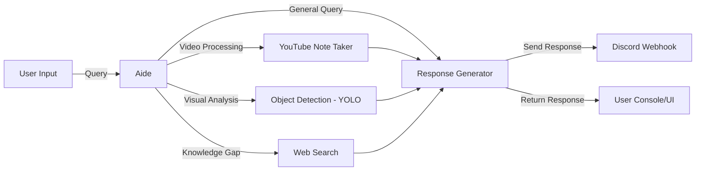

# Aide
Your personal AI agent with multi-capability workflows.  
## Overview
**Aide** is an AI-powered agent designed to simplify everyday tasks by combining multiple tools into one system.  
It can summarize YouTube videos, perform web searches when knowledge is missing, run object detection with YOLO, and send information directly to your Discord.  
Think of it as a lightweight personal assistant that saves you time by automating tedious steps.
## Architecture

## Features and Technical Highlights
- **YouTube Note Taking** <br> 
   Automatically generates concise notes from any YouTube video link so you don’t need to watch the full video.
- **Object Detection**<br>
   Uses YOLO to detect and label objects in images, enabling fast visual analysis.
- **Web Search**<br>
   Falls back to Google search when it doesn’t know the answer, ensuring up-to-date responses. 
- **Discord webhook**<br>
   Sends summaries, search results, and detections directly to your Discord for easy access.

## Getting Started
Follow these steps to setup Aide on your local machine.
### Prerequisite
- **Tauri** and **npm**
- API keys for **Gemini**, **Tavily** and **Discord Webhook**
### Installation
1. Clone the repository:

   ```bash
   git clone https://github.com/ItsAbhinavM/Aide.git
   cd Aide/
   ```

2. Install front-end dependencies:

   ```bash
   cd aide/
   npm install
   ```
3. Install back-end packages on a virtual environmen:
   ```bash
   cd ..
   cd backend/
   python -m venv venv
   source venv/bin/activate/
   pip install -r requirements.txt
   ```
3. Set up environment variables:

   Follow the [.env.sample](https://github.com/ItsAbhinavM/Aide/blob/main/backend/.env.sample) template and add your own API keys.

4. Start the development server:

   ```bash
   # Run front-end
   npm run tauri build
   # Run back-end
   uvicorn main:app --reload
   ```
